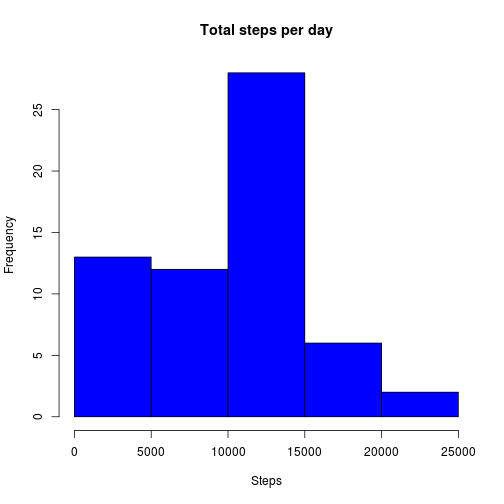
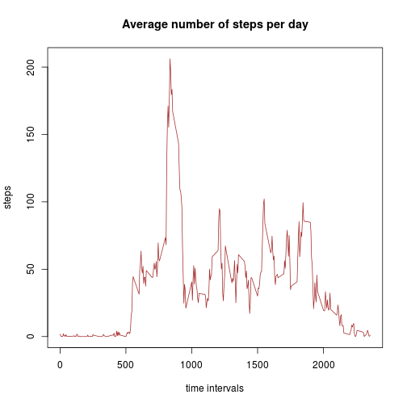
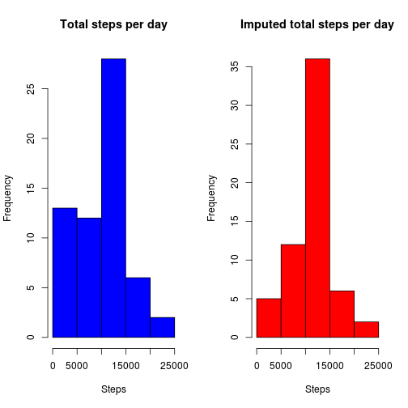
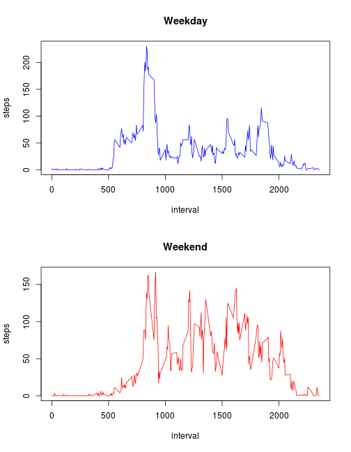

Activity Monitoring Data Report
===============================

## -Sungmin Kim-

This report summarizes a person's monitored daily activity for two months 
based on the number of steps each day.  With providing a lot of details 
including plots and R code, we can figure out this person's average patterns
of movement and draw a rough, but useful conclusion. 


### (1) Loading and oreprocessing the data  

First, we need to load the data.  

```r
data <- read.csv("activity.csv")
```
Here we have our data!  
 

### (2) What is mean total number of steps taken per day?
In order for our data to be analyzed efficiently, we need our data to be tidy.
In our case, it is important to remove all missing values.  
We need to calculate the total number of steps per day and create a histogram to 
show the total number of steps taken each day.

```r
totalSteps <- tapply(data$steps, data$date, sum, na.rm = TRUE) 
hist(totalSteps, col = "blue", xlab = "Steps", 
     main = "Total steps per day")
```

 

Now we need to calculate the mean and median of the total number of steps taken per day. 

```r
meanStep <- mean(totalSteps)
medianStep <- median(totalSteps)
```
Mean : *9354.2295082*  
Median : *10395*  

### (3) What is the average daily activity pattern?

Let's create a plot of the 5-minute interval and the average number of steps taken.
Before that, we need to calculate the mean step each day. 

```r
meanEach <- tapply(data$steps, data$interval, mean, na.rm = TRUE)
plot(row.names(meanEach), meanEach, type = "l", col = "brown", 
     xlab = "time intervals", ylab = "steps", 
     main = "Average number of steps per day")
```

 

This time we need to figure out which interval contains the maximum number of steps.

```r
maxStep <- which.max(meanEach)
intervalMax <- names(maxStep)
```
Interval *835* contains the maximum number of steps.  

### (4) Imputing missing values  

First, we need to calculate the number of missing values in our dataset. 

```r
numMissing <- sum(is.na(data$steps))
```

There are *2304* number of missing values.   
Now, we are going to fill all missing values with some meaningful values.   
And this time we need to create a new dataset that is equal to our original but with 
missing values filled in. 

```r
newData <- data
for(i in 1:dim(newData)[1]){
    if(is.na(newData[i, 1])){
        interval <- newData[i, 3]
        value <- meanEach[names(meanEach) == as.character(interval)]
        newData[i, 1] <-  value[[1]]          
    } 
}
```

In this step we need to make a histogram of the total number of steps taken each day
and calculate and report the *mean* and *median* total number of steps taken each day. 

```r
imputedTotalSteps <- aggregate(steps ~ date, data = newData, sum)
par(mfrow = c(1,2))
hist(totalSteps, col = "blue", xlab = "Steps", 
     main = "Total steps per day")
hist(imputedTotalSteps$steps, col = "red", xlab = "Steps", 
     main = "Imputed total steps per day")
```

 

```r
imputedMeanStep <- mean(imputedTotalSteps$steps)
imputedMedianStep <- median(imputedTotalSteps$steps)
```
Imputed mean step : *1.0766189 &times; 10<sup>4</sup>*  
Imputed median step : *1.0766189 &times; 10<sup>4</sup>*  

Calculate the difference in mean and median of total number of steps. 

```r
meanDiff <- imputedMeanStep - meanStep
medianDiff <- imputedMedianStep - medianStep
```
Difference in mean : *1411.959171*  
Difference in median : *371.1886792*  

As we can see, there are remarkable differences in the total number of steps. For the range 
between 0 and 5000 steps, the bar in the imputed graph is much shorter than that of the original
graph. This is because we replaced all NA values by some numbers and we lost a lot of zeroes.  

### (5) Are there differences in activity patterns between weekdays and weekends?

We need to create a new factor variable in our dataset with two levels, 'weekday' and 'weekend'.
After that, make a plot to see the average steps between weekday and weekend. 

```r
wd <- weekdays(as.Date(newData[,2])) 
newData$weekday <- "weekday"
for(j in 1:dim(newData)[1]){
    if(wd[j] == "Saturday" | wd[j] == "Sunday"){
        newData[j,4] <- "weekend"
    }
}

spl <- split(newData, newData$weekday) #split into two groups
x <- tapply(spl$weekday$steps, spl$weekday$interval, mean)
y <- tapply(spl$weekend$steps, spl$weekend$interval, mean)

par(mfrow = c(2,1))
plot(row.names(x), x, type = "l", col = "blue", xlab = "interval", 
     ylab = "steps", main = "Weekday")
plot(row.names(y), y, type = "l", col = "red", xlab = "interval", 
     ylab = "steps", main = "Weekend")
```

 
